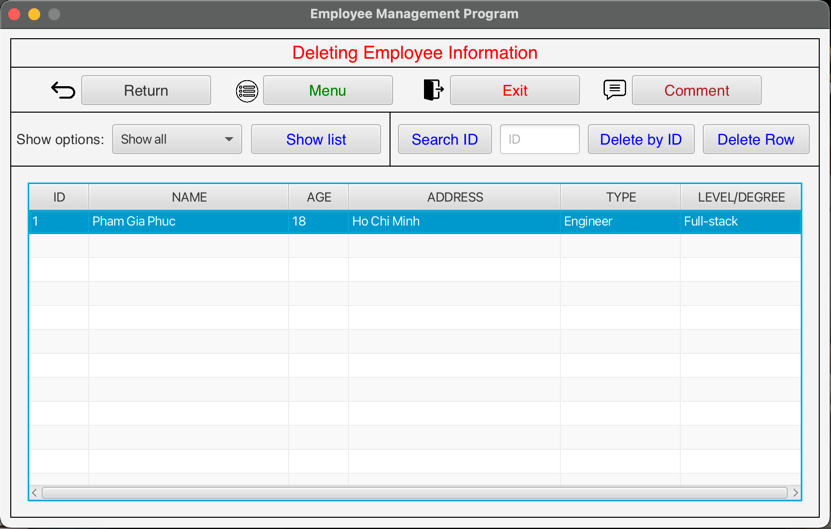

# Employee Management - version: EA.01

- This is a management program of human resource in a company (without a log-in stage).
- Project link (GitHub) : https://github.com/phamgiaphuc/EmployeeManagement-EM.01
- Project's author: Pham Gia Phuc - Acus
- Personal profile: https://github.com/phamgiaphuc

### Languages and tools in this project:

1. Java (Back-end).
2. JavaFX (Front-end).
3. Object-Oriented Programming (OOP) and OOP principles.
4. Maven.
5. Class diagram.

-----------------------------------
<ins>

### USER GUIDE

</ins>

### STEP 1:  Before running program, you make sure your computer already installed tools below:

- JDK 18.0.2 or later.
- Maven 4.0.0 or later.
- OpenJFX 18 or later

> I recommend JDK and JFX version must be match in order to have full experience to run the program successfully.

### STEP 2: Program is configured as follows

- There is an admin view which contains **six functions**:add, show, edit, delete, comment, exit and a dashboard

### STEP 2: Run the program

- To run the program, go to src/main/java/pham/phuc/employee_data/Application.java.

-----------------------------------
<ins>

### OPERATING ILLUSTRATION PICTURES

</ins>

- Functions in the application's menu: Add, Show, Edit, Delete, Comment, Exit

**- Menu's view with a dashboard and functions**

**1. Add function - `Add view`: filling the employee information to add to the list.txt.**

**2. Show function - `Show view`: Show all the employee or workers/engineers from the list.txt file or search an employee by id.**

**3. Edit function - `Edit view`: Choose an employee to edit by searching ID or show list to click (double click) a row to edit.**

**4. Delete function - `Delete view`: Search an ID or click (double click) a row to delete.**

**5. Comment function - `Comment view`: Give a comment or a note and store it in notes.data file.**

**6. Exit function - `Exit` : Quit the program.**